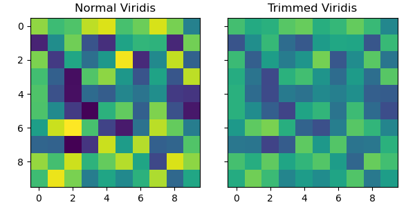

# ColorTools

A personal project to simplify the way I work with custom colors and colormaps in Matplotlib. 

## Features

- **Interpolate Colors**: Generate smooth gradients between two colors.
- **Color Conversion**: Switch between hex and RGB color formats.
- **Trim Colormaps**: Create custom colormaps by limiting their color range.

Note: All of this functionality exists in matplotlib. For example:
- **Convert Format**: [matplotlib.colors.to_hex()](https://matplotlib.org/stable/api/_as_gen/matplotlib.colors.to_hex.html)
- **Interpolate**: [LinearSegmentedColormap.from_list()](https://matplotlib.org/stable/api/_as_gen/matplotlib.colors.LinearSegmentedColormap.html#matplotlib.colors.LinearSegmentedColormap)

## Installation

Just copy `ColorTools.py` into your project directory and import it.

Alternatively, use a relative import if you have it in a package


## Usage Examples

##### Import
```python
from ColorTools import interpolate_colors, rgb_to_hex, hex_to_rgb, trim_cmap
```

##### Interpolation
```python
from ColorTools import interpolate_colors

# Generate a gradient between red and blue with 5 colors
colors = interpolate_colors("#FF0000", "#0000FF", 5)
print(colors)
# Output: ['#ff0000', '#bf003f', '#80007f', '#4000bf', '#0000ff']
```

##### Convert Formats
```python
from ColorTools import hex_to_rgb, rgb_to_hex

# Convert hex to RGB
rgb = hex_to_rgb("#1E90FF")
print(rgb)  # Output: (30, 144, 255)

# Convert RGB to hex
hex_color = rgb_to_hex((30, 144, 255))
print(hex_color)  # Output: '#1e90ff'

```

##### Trim Colormaps
```python
from ColorTools import trim_cmap
import matplotlib.pyplot as plt
import numpy as np

cmap = 'viridis'
trimmed_cmap = trim_cmap('viridis', 0.2, 0.8)

fig, axs = plt.subplots(1, 2, figsize=(6, 3), sharey=True)
arr = np.random.random((10, 10))
axs[0].imshow(arr, cmap=cmap)
axs[1].imshow(arr, cmap=trimmed_cmap)

axs[0].set_title("Normal Viridis")
axs[1].set_title("Trimmed Viridis")


plt.tight_layout()
plt.savefig("plotdemo.png")
plt.close()
```



## License
This project is free to use for any purpose. 
